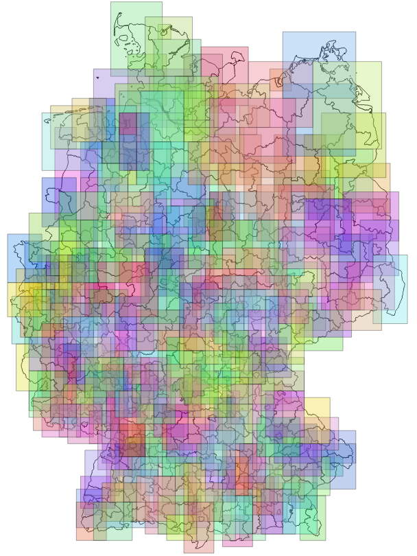

# verwaltungsgebiete-bounding-boxes

Exports bounding boxes of German administrative areas as CSV.

# Prerequisites

These scrips use PostGIS to filter stops belonging to administrative regions covered by the transport company.  
See [this project](https://github.com/highsource/postgis-verwaltungsgebiete) for a simple way to create a PostGIS database with administrative regions.

# Usage

## Districts (Kreise)

```
psql^
 --username=postgres^
 --dbname VG^
 -f export-kreise-bounding-boxes.sql^
 --set=precision="0.1"^
 --set=buffer="0.05"^
 --set=output="'%cd%\kreise-bounding-boxes.txt'"
```

Parameters:

* `buffer` - will be substracted from `minx` and `miny` and added to `maxx` and `maxy`.
* `precision` - used to round the bounding box coordinates.

Produces:

```
rs,minx,miny,maxx,maxy,bbox_wkt
01001,9.3,54.7,9.6,54.9,"POLYGON((9.3 54.7,9.3 54.9,9.6 54.9,9.6 54.7,9.3 54.7))"
```

Screenshot from QGIS:



#License

Scripts are licensed under [BSD 2-clause license](LICENSE).